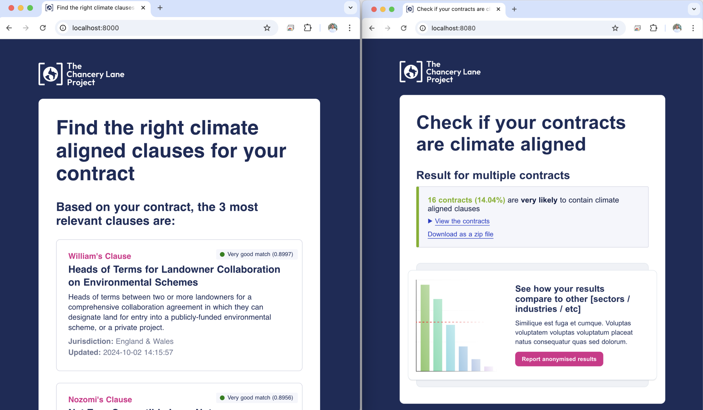

# TCLP x Faculty AI Fellowship December 2024 
## Detecting climate-aligned content in contracts and recommending TCLP content for contracts that are not already climate-aligned


## About the Project
The Chancery Lane Project was interested in exploring how AI could be used to increase organizational impact. This project included three sub-tasks: 
1. #### **Clause Recommender**  
   A **LegalBERT model**, paired with cosine similarity, analyzes contracts or legal documents to recommend the most relevant TCLP clauses.  

   **Output:** The top three most applicable clauses for the document.

3. #### **Clause Generation**  
   To create a synthetic database of contracts with TCLP-style content, an **OpenAI LLM** was fine-tuned on TCLP clauses.  

   **Key Highlights:**
   - Generated 1,800 novel clauses in TCLP style based on combinations of three keywords.
   - Keywords were derived from the most frequent terms in the original ~200 clauses.

4. #### **Clause Detection**
   The standout feature of the project, the **Clause Detector**, identifies the likelihood of TCLP or TCLP-inspired clauses (a.k.a. climate-aligned content) in a document. It uses a **TDIF vectorizer with logistic regression for binary classification**, applied on chunks of text. Then, these results are extrapolated to the entire document, combined with a threshold for **multiclass classification**. 

   **Performance:**  
   - Achieved **94% accuracy** on the test set.  
   - Enables efficient and precise metrics for TCLP to measure impact.

## Getting Started 

Follow these steps to set up the project and run it locally:

### Prerequisites

Make sure you have the following installed:
- [Docker Desktop](https://www.docker.com/products/docker-desktop) (installed and running)
- Git (to clone the repository)
- Python and poetry installed on your machine

### Setup Instructions

#### Clone the Repository
Open your terminal and run:
```
`git clone https://github.com/chancery-lane-project/Clause-Comparison.git`
`cd Clause-Comparison`
```
Make sure you have a Personal Access Token set-up; instructions [here](https://docs.github.com/en/authentication/keeping-your-account-and-data-secure/managing-your-personal-access-tokens).

#### Download and Prepare the Model
Download the model and embeddings from [this link](https://drive.google.com/file/d/1sTpo9iOjhoCZ1qteLqry8jjezWTanSl_/view?usp=drive_link), unzip it, and place the files into the `Clause-Comparison/tclp/legalbert` folder to ensure the paths are correctly configured. If you are interested in having testing data or running some of the training notebooks, you can download the data from [this link](https://drive.google.com/drive/folders/1UJqd7kyTgziS1sDf67KQWfdg80hduY6w?usp=drive_link). Place those files in 'Clause-Comparison/tclp/data'. The baseline data (including the clauses themselves) is already included for you in this repo, so it will be installed locally when you clone. 

#### Run the Project with Docker
From the root directory of the project (`Clause-Comparison`), within your terminal:
```
`docker-compose up --build`
```
This will build and start the application. Make sure the Docker application is open and running. Then, you can navigate to the 'containers' tab in Docker and click one of the two links to see either the Clause Recommender or Clause Detector. 

You are now ready to explore the project's features!

## Data and Model Access
Discussed in the previous section, in case you missed it, repeated here for comprehensiveness. 

### Access All Data 
[Google drive folder](https://drive.google.com/drive/folders/1UJqd7kyTgziS1sDf67KQWfdg80hduY6w?usp=drive_link) 
Download this and place it in Clause-Comparison/tclp/data

### Access LegalBERT model and embeddings 
[Google drive folder](https://drive.google.com/file/d/1sTpo9iOjhoCZ1qteLqry8jjezWTanSl_/view?usp=drive_link)
Download this and place it in Clause-Comparison/tclp/legalbert

## Usage
If you are **interested in using the frontend applications**, those will immediately be launched on a local server once you build the docker. They are designed to have a **simple user inteface**, easily intuited by non-technical and technical users alike. 

If you wish to explore the code in more depth and desire further ideas about exploration, please refer to the in-depth tour of the repo just below. 

## Repo Tour 
If you are more technically inclined, and want to understand the backend of these applications and the repository structure, this section is for you. 

### Landing Page

- **[`tclp/`](tclp)**: This is the main folder where most of the project code and data are located. Any downloaded models or embeddings should be placed in this directory for the project to function correctly. Think of it like an src file in other projects.
- **[`.dockerignore`](.dockerignore) and [`.gitignore`](.gitignore)**: These files define which files or folders should be excluded from Docker images and Git commits, respectively. These are important for discluding large stores of data from this repo. 
- **[`Dockerfile`](Dockerfile)**: Contains the instructions to build the Docker container for the project.
- **[`docker-compose.yaml`](docker-compose.yaml)**: Simplifies the setup of Docker services. It ensures the application and its dependencies are properly configured and running.
- **[`poetry.lock`](poetry.lock) and [`pyproject.toml`](pyproject.toml)**: Used for managing Python dependencies via Poetry. These files ensure consistent dependency versions and mean the user can easily install the required environment. 
- **[`README.md`](README.md)**: This document! 
- **[`readme_image.png`](readme_image.png)**: The opening image of this document.

### tclp 
Inside this source document there are further files and sub-folders. 

- **[`LLMs/`](tclp/LLMs)**: Contains notebooks and jsonl files for finetuning an OpenAI LLM with TCLP clauses.
   - **[`notebooks/`](tclp/LLMs/notebooks/)**: Contains Jupyter notebook for experimentation and preprocessing.  
     - **[`adding_noise.ipynb`](tclp/LLMs/notebooks/adding_noise.ipynb)**: A specific notebook for generating new clauses using the fine-tuned LLM. Termed 'adding noise' because the idea was to add noise to these clauses for more generalizability. 
   - **[`chat_fine_tuning.jsonl`](tclp/LLMs/chat_fine_tuning.jsonl)**: A JSONL file formatted for fine-tuning LLMs on chat data; contains sample dialogues or clauses used for training.
     
- **[`clause_detector/`](tclp/clause_detector)**: The logic, scripts, and exploratory notebooks for identifying whether a document contains TCLP-inspired or climate-aligned clauses.
   - **[`notebooks/`](tclp/clause_detector/notebooks)**: Jupyter notebooks for training the model and decting clauses.
      - **[`clause_detector.ipynb`](tclp/clause_detector/notebooks/clause_detector.ipynb)**: A notebook that provides an interactive environment for testing and debugging the clause detection pipeline. Includes functionality for running detection on sample inputs and inspecting outputs.
      - **[`highlighted_output.html`](tclp/clause_detector/notebooks/highlighted_output.html)**: An HTML file used to visualize the detection results, highlighting identified clauses directly within the document.
      - **[`training_model.ipynb`](tclp/clause_detector/notebooks/training_model.ipynb)**: This notebook is used for training or fine-tuning the clause detection model. It  includes steps for preparing data, defining the model, and evaluating its performance.
   - **[`py_scripts/`](tclp/clause_detector/py_scripts)**: Simpler python scripts for running the model and inserting a clause to generate the synthetic database.
      - **[`clause_detector.py`](tclp/clause_detector/py_scripts/clause_detector.py)**: A simplified version of the main Python script that interacts within the frontend, implementing the clause detection logic and using the pre-trained model.
      - **[`insert_clause.py`](tclp/clause_detector/py_scripts/insert_clause.py)**: A script designed to insert clauses into legal documents, creating the synthetic database used in the rest of clause_detector.
   - **[`clause_identifier_model.pkl`](tclp/clause_detector/clause_identifier_model.pkl)**: A pre-trained machine learning model that powers the clause detection process.
   - **[`detector.py`](tclp/clause_detector/detector.py)**: The main script that contains the core logic for identifying clauses in documents.
   - **[`detector_utils.py`](tclp/clause_detector/detector_utils.py)**: Contains helper functions, such as preprocessing and result formatting, used by the main detector.
   - **[`index.html`](tclp/clause_detector/index.html)**: An HTML template for rendering the detection results in frontend interface.

- **[`clause_recommender/`](tclp/clause_recommender)**: The logic, scripts, and GUIs for suggesting the most relevant TCLP clauses for a given legal document.
   - **[`GUIs/`](tclp/clause_recommender/GUIs)**: Contains resources and components for building graphical interfaces for the recommender. These interfaces allow users to interact with the application in a user-friendly manner. GUIs exist for different methods tested. The chosen method (legalbert) is better accessed through Docker.
      - **[`bowGUI.py`](tclp/clause_recommender/GUIs/bowGUI.py)**: A graphical interface to interact with the Bag-of-Words (BoW) model for clause recommendation. Useful for exploring results using a traditional, word-count-based approach.
      - **[`doc2vecGUI.py`](tclp/clause_recommender/GUIs/doc2vecGUI.py)**: Provides a GUI for interacting with the Doc2Vec model, a vector-based representation of documents for more context-aware clause recommendation.
      - **[`legalBERTGUI.py`](tclp/clause_recommender/GUIs/legalBERTGUI.py)**: The graphical interface for the LegalBERT model, which leverages transformer-based language modeling tailored for legal documents. This model is better accessed through the Docker frontend. 
   - **[`app.py`](tclp/clause_recommender/app.py)**: The main script that powers the Clause Recommender application. It allows the user to call the legalbert model and associated embeddings for recommendation of the best clause. 
   - **[`clause_matcher.py`](tclp/clause_recommender/clause_matcher.py)**: This script provides the LegalBERTMatcher class, which uses a pre-trained LegalBERT model to find the best matching clauses for a given query text.
   - **[`index.html`](tclp/clause_recommender/index.html)**: Provides the structure and layout for the clause recommender's frontend interface.
   - **[`utils.py`](tclp/clause_recommender/utils.py)**: A utility script containing helper functions that support the core logic, such as preprocessing and formatting.
   
- **[`data/`](tclp/data/)**: A directory including clauses for running the existing models. If you wish to run all the content of this repo, you will need to populate this with the google drive link above.
   - **[`clause_boxes/`](tclp/data/clause_boxes)**: Contains files for representing clauses in an organized, user-friendly way for frontend, HTML format.
   - **[`cleaned_clauses_detect/`](tclp/data/cleaned_clauses_detect)**: Includes cleaned and preprocessed clauses, glossary terms, and guides used for LLM training and clause_detector training.
   - **[`cleaned_clauses/`](tclp/data/cleaned_clauses)**: A specialized subset that only includes clauses tailored for clause recommending tasks. The user will only get a clause of the England/Wales jurisdiction.  
   - **[`synth_data/`](tclp/data/synth_data)**: Empty folder for the user to replace with synthetic data, either generated by the LLM locally or downloeaded from google drive. 
   - **[`test_contracts/`](tclp/data/test_contracts)**: Empty folder to be populated by the user in training their own version of this model or pulled from the google drive.
     
- **[`xml_parse.py`](tclp/xml_parse.py)**: A script to extract relevant contnent from the TCLP website. To run, you will need to have an xml file of the entire website. 
- **`__pycache__/`**: A Python-generated folder that caches compiled files for faster execution.
- **`.DS_Store`**: A macOS-specific file that stores folder metadata. This can be ignored or deleted as it serves no purpose for the project.
- **`__init__.py`**: Allows Python to treat this folder as a package, enabling imports from this directory in other scripts.

## License
This project is licensed under MIT licensure; the full text can be found [here](License.txt)

## Contact 
Any questions about this repo? Feel free to reach out to **Georgia Ray (99gray@gmail.com)**.
